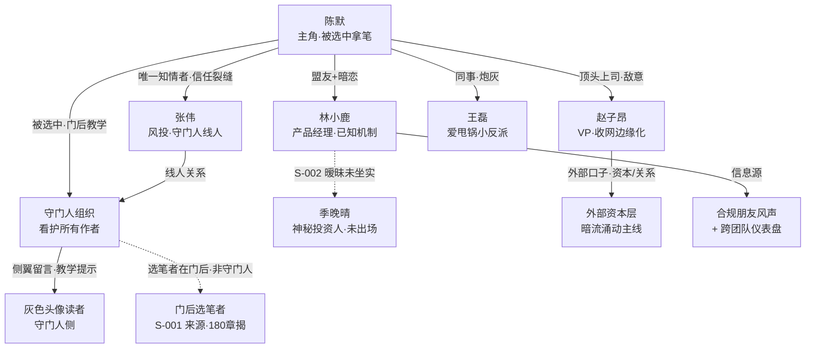
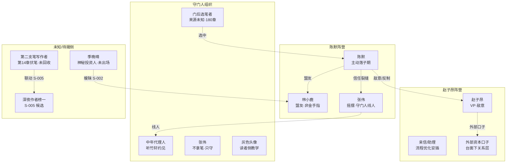
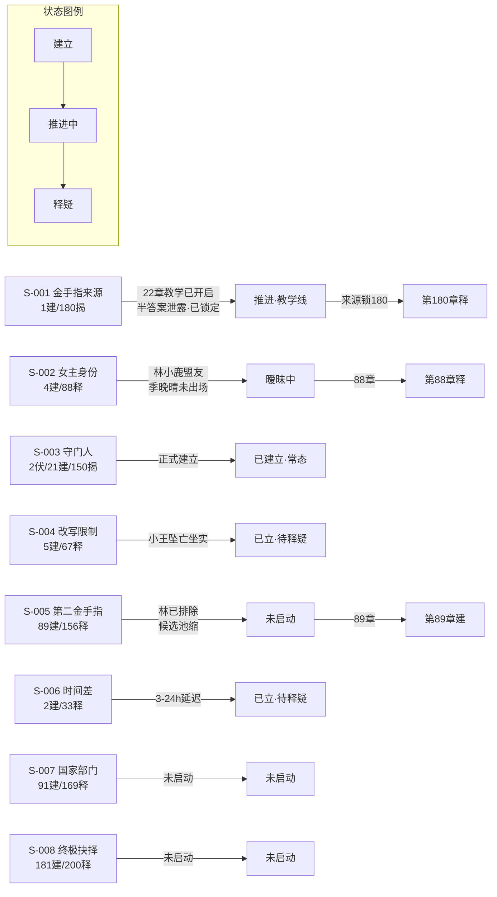

# 关键情节图解（1–23 章快照，续写前全局视图）

> 三张 Mermaid 图：人物关系 / 势力分布 / 悬念线状态。基于 `.learnings/` 四文件（STORY_BIBLE / CHARACTERS / PLOT_POINTS / 续写路线图）绘制，独立可渲染。
> 续写推进后，回看此图核对「谁和谁什么关系、谁在哪个阵营、哪条线还悬着」。

---

## 一、人物关系图

**读法**：实线=已确立关系，虚线=暧昧/未坐实。陈默处于网络中心；季晚晴、门后选笔者、外部资本为「未完全揭开」节点，是续写解谜主力。

---

## 二、势力分布图

**读法**：张伟是跨 A/C 的「桥」（陈默死党却受守门人节制），这是信任裂缝的根源。D 组全为未揭节点——续写主战场在 B3（外部口子，31–90 暗流涌动）与 D1/D3（第二支笔，31–45 回收）。

---

## 三、悬念线状态图（S-001 ~ S-008）

**读法**：
- **已立待释**（续写可推进）：S-004（67章）、S-006（33章）、S-003（150章）。
- **进行中**（续写主推）：S-001 教学线（来源锁 180，不提前）、S-002 暧昧（88 章）。
- **未启动**（远期）：S-005（89）、S-007（91）、S-008（181）。
- **特别警示**：S-001 已在 21–22 章泄露半答案（E-015），续写须「教学≠来源」解耦，来源严格锁 180 章。

---

## 四、续写杠杆速查（基于以上三图）

| 维度 | 当前状态 | 续写动作（见 `续写路线图.md` 24–45） |
|------|----------|--------------------------------------|
| 打脸脉冲 | 1–22 仅 3 次（E-001） | 24/25/26轻/27/29/30 每 1–2 章 1 次 |
| 陈默主动 | 23 章才首胜（E-002） | 常态主动落子，被动仅作代价 |
| 阵营对抗 | 赵子昂+外部口子（B3） | 31–90 主战场，探明口子+反制 |
| 断线回收 | 灰色头像(23已回)/林源(23已闭) | 第二支笔(31启)、季晚晴(34/37)、赵口子(持续) |
| 守门人分层 | 21 接触→?→? | 39「门后有人」→50 教学成型，来源仍锁 180 |
